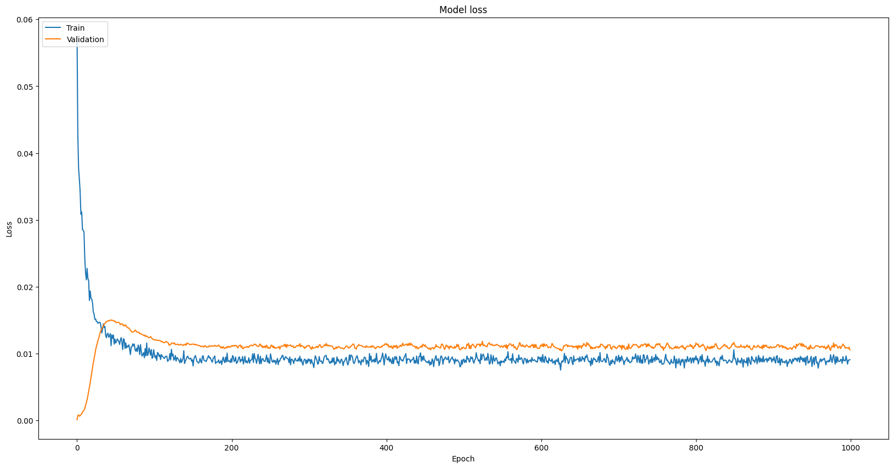
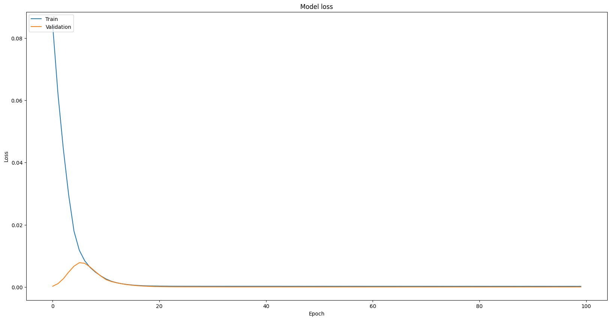

# time-series-da

Data Analysis for Time Series Analysis

- 
- 

- [가상환경구성하기](./docs/%EA%B0%80%EC%83%81%ED%99%98%EA%B2%BD%EA%B5%AC%EC%84%B1.md)

### 참고자료

- [딥러닝을 이용한 비트코인 가격 예측 비교연구](./docs/A_Comparative_Study_of_Bitcoin_Price_Prediction_Us.pdf)

## Getting Started

1. 가상환경 실행

```bash
python -m venv venv
venv\Scripts\activate.bat
(venv) pip install -r requirements.txt
```

2. Run on Jupyterlab(Optional)

```bash
jupyter lab
# CMD: cntrl+Z // jupyterlab 종료
```

---

## ToDo

- [ ] CNN(1D)
  - [x] ~~Conv1D Historical Implementation~~ @23-05-09
    > 1시간, 5분 구현에 성공했으나, 가중치에 따른 편차가 크고, 레이어 구성이 단순하여 지나친 일반화가 의심됨.
  - [ ] Conv1D Forecasting
    - 생성한 모델로 신규데이터에 대한 예측 도출
- [ ] CNN(2D)
  - [ ] Conv2D Historical Implementation
  - [ ] Conv2D Forecasting
- [ ] LSTM
- [ ] Prophet
- [ ] GRU
- [ ] CNN + LSTM
- [ ] Flask

## Flask

- [A Comprehensive Guide on using Flask for Data Science](https://www.analyticsvidhya.com/blog/2021/10/a-comprehensive-guide-on-using-flask-for-data-science/)

- [Building a Machine Learning Web Application Using Flask](https://towardsdatascience.com/building-a-machine-learning-web-application-using-flask-29fa9ea11dac)

- [Deploying an ML web app using Flask](https://levelup.gitconnected.com/deploying-ml-web-app-using-flask-334367735777)

```bash
.
└──Flask-App
  ├── /app
  │   ├── run.py
  │   ├── index.html
  │   └── /templates
  ├── /data
  ├── /notebook
  ├── /model
  │   ├── classifier.py
  │   └── loan_data.pkl
  ├── /static
  │   └── /src
  ├── /utils
  ├── run.py
  ├── pipfile
  ├── pipfile.lock
  └── README.md
```

> style은 cdn으로 연결.

## Historical 데이터분석 + RealTime 데이터분석

> 기존 데이터를 불러와 분석결과를 표시하는 것과 실시간 데이터를 불러와 분석하는 방법 제시.

이를 구현하기 위해, 코인 별(위 경우, 비트코인)로 오로지 하나의 data만을 가지고 있는 것이 좋다. 데이터가 추가되는 경우 `append`한다.

## Conv1D

### loss and val_loss

- loss: training data에 대한 오차
- val_loss: validation data에 대한 오차

#### Overfitting

모델 학습이 잘 이루어졌다면, loss와 val*loss가 모두 낮아지는 경향을 보인다. 그러나 모델이 overfitting 되었다면 loss는 계속 감소하지만 val_loss는 증가할 수도 있다. 이는 모델이 training data에만 과적합되어 \_unseen*데이터에 대한 일반화 성능이 떨어질 가능성이 크기 때문에, 모델 구조나 학습 방법을 조정해야 한다.



이와 같은 과적합은 모델을 구성하면서 학습데이터에 대해 과도하게 최적화되어 있어 다른 데이터에 대한 일반화 성능이 떨어지기 때문이다(아래는 epochs의 진행에 따라 loss와 val_loss가 0에 수렴하는 이상적인 그래프).


### Optimizer

1. `adam`
2. ~~`RMSprop`(Root Mean Sqaure Propagation)~~

## Issues

- [ ] API
      CNN-LSTM(kaggle버전)에서 사용하는 poloniex의 api는 `{period}` key(GET)로 불러올 수 있는 기간을 제한하고 있다. 더불어, 유일하게 제공하는 시계열 값인 timestamp가 unix timestamp이다.

이를 해결하기 위해 bitstamp에서 제공하는 1시간 단위의 dataset(`.csv`)을 이용한다.

단, 여전히 api로 실시간 데이터를 불러와 json을 csv로 저장하거나, 기존 데이터에 append할 수 있도록 준비하는 것은 중요하다.

- [x] ~~unix timestamps~~

  - 장점: 데이터 타입을 string이 아닌 long으로 받을 수 있다.
  - 단점: 인코딩 과정 필요(pd.to_datetime(..., unit='s')를 사용할 수 없는 경우 format으로 해결해야 한다.)

- [ ] Dataset _보류_
  - data의 인덱스를 아래와 같이 고정.
  - ~~dataset은 plato에 비공개~~

| Key       | Desc.      |
| :-------- | :--------- |
| timestamp | 날짜(시간) |
| open      | 시가       |
| close     | 종가       |
| high      | 고가       |
| low       | 저가       |
| vol       | 볼륨       |
